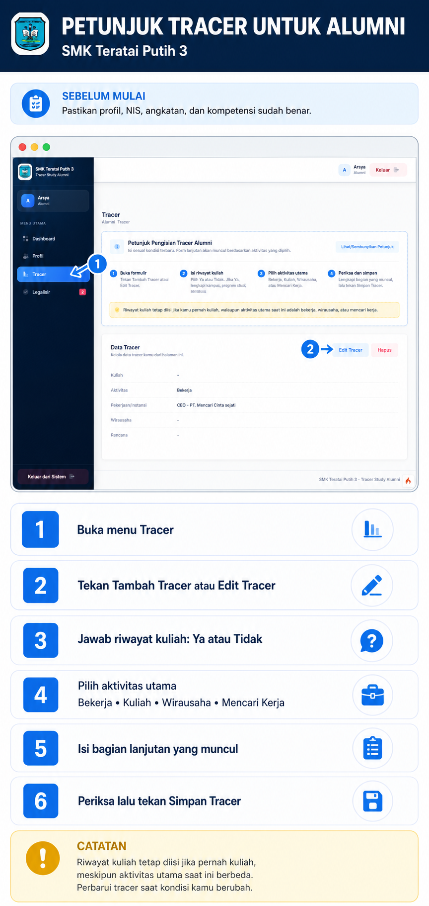
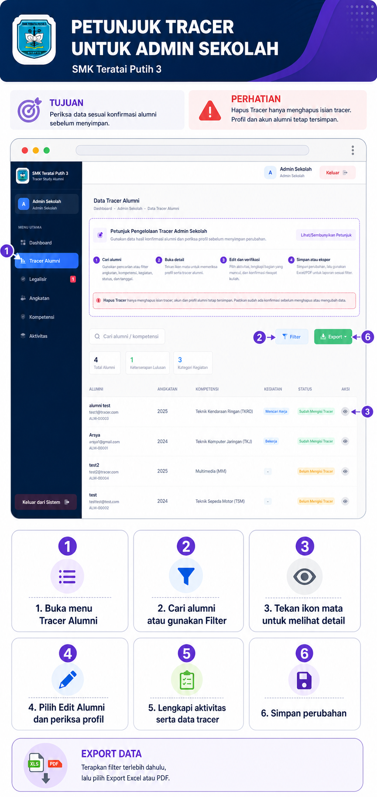

# Petunjuk Pengisian Tracer Study

Panduan ini menjelaskan cara mengisi dan memperbarui data tracer melalui akun Alumni serta cara memeriksa dan membantu pengisian melalui akun Admin Sekolah.

## Ketentuan Umum

- Gunakan kondisi alumni yang paling baru dan dapat dipertanggungjawabkan.
- Kolom bertanda wajib harus diisi sebelum data dapat disimpan.
- Pilih satu aktivitas utama saat ini: Bekerja, Kuliah, Wirausaha, atau Mencari Kerja.
- Riwayat kuliah tetap dapat dicatat walaupun aktivitas utama alumni saat ini adalah bekerja, berwirausaha, atau mencari kerja.
- Jangan memasukkan data pribadi atau penghasilan alumni tanpa persetujuan pemilik data.

## A. Petunjuk untuk Alumni

### Persiapan

1. Masuk menggunakan akun Alumni.
2. Lengkapi profil, terutama NIS, angkatan, dan kompetensi keahlian.
3. Buka menu **Tracer** pada sidebar.

### Langkah Pengisian

1. Tekan **Tambah Tracer**. Jika data sudah pernah disimpan, gunakan **Edit Tracer**.
2. Jawab pertanyaan **Apakah kamu pernah atau sedang berkuliah?**
   - Pilih **Ya** jika pernah atau sedang kuliah, kemudian isi perguruan tinggi, program studi, dan status kuliah.
   - Pilih **Tidak** jika belum pernah kuliah.
3. Pada **Status Aktivitas**, pilih kondisi utama saat ini.
4. Lengkapi bagian yang muncul sesuai aktivitas:

| Aktivitas | Data yang perlu dilengkapi |
| --- | --- |
| Bekerja | Posisi/jabatan, nama dan bidang instansi, tahun mulai kerja, rentang penghasilan, alamat instansi, serta kesesuaian dengan kompetensi keahlian. |
| Kuliah | Perguruan tinggi, program studi, dan status kuliah. |
| Wirausaha | Nama usaha, bidang usaha, modal awal, rentang penghasilan usaha, serta kesesuaian dengan kompetensi keahlian. |
| Mencari Kerja | Catatan atau rencana ke depan, misalnya bidang pekerjaan yang dituju atau rencana pelatihan. |

5. Periksa kembali data, lalu tekan **Simpan Tracer**.
6. Pastikan ringkasan pada kartu **Data Tracer** sudah menampilkan data terbaru.

### Visual Halaman Alumni

> Gunakan **Edit Tracer** ketika kondisi berubah. Tombol **Hapus** menghapus data tracer milik alumni, sehingga gunakan hanya jika memang diperlukan.

## B. Petunjuk untuk Admin Sekolah

### Memeriksa Data Tracer

1. Masuk menggunakan akun Admin Sekolah.
2. Buka menu **Tracer Alumni**.
3. Gunakan kotak pencarian atau tombol **Filter** untuk menyaring data berdasarkan angkatan, kompetensi, kegiatan, status pengisian, atau tanggal.
4. Tekan ikon mata pada baris alumni untuk membuka **Detail Profil dan Tracer Alumni**.

### Membantu Mengisi atau Memperbarui Data

1. Dari modal detail, tekan **Edit Alumni**.
2. Pastikan profil dasar alumni benar, terutama nama, email, NIS/NISN, angkatan, dan kompetensi.
3. Pilih **Aktivitas Alumni**. Bagian isian akan menyesuaikan pilihan:
   - **Bekerja:** lengkapi pekerjaan, instansi, penghasilan, dan relevansi kompetensi.
   - **Wirausaha:** lengkapi nama usaha, bidang usaha, modal, penghasilan, dan relevansi kompetensi.
   - **Kuliah:** lengkapi universitas, program studi, dan status kuliah.
   - **Mencari Kerja:** lengkapi rencana ke depan.
4. Jika alumni pernah atau sedang kuliah, isi bagian **Profil Kuliah** walaupun aktivitas utamanya bukan Kuliah.
5. Tekan **Simpan Perubahan** dan pastikan status berubah menjadi **Sudah Mengisi Tracer**.

### Laporan dan Koreksi

- Gunakan **Export Excel** atau **Export PDF** setelah filter diterapkan agar hasil laporan mengikuti data yang sedang ditampilkan.
- **Hapus Tracer** hanya menghapus isian tracer; profil dan akun alumni tetap tersimpan.
- Hindari mengubah data alumni tanpa konfirmasi. Catat sumber pembaruan bila data diperoleh melalui telepon, formulir, atau wawancara.

### Visual Halaman Admin Sekolah

## Pemeriksaan Sebelum Menyimpan

- Aktivitas utama sesuai kondisi terbaru alumni.
- Riwayat kuliah sudah dijawab dan diisi bila relevan.
- Tahun mulai kerja menggunakan empat digit, misalnya `2026`.
- Modal dan penghasilan tidak menggunakan keterangan yang bertentangan dengan pilihan aktivitas.
- Tidak ada data milik alumni lain yang tercampur.

## Jika Data Tidak Dapat Disimpan

1. Periksa kembali kolom wajib dan format email/tanggal.
2. Pastikan sesi belum berakhir; muat ulang halaman dan masuk kembali jika diperlukan.
3. Hindari membuka form alumni yang sama pada beberapa tab secara bersamaan.
4. Jika masalah tetap terjadi, catat nama alumni, waktu kejadian, dan pesan kesalahan untuk diperiksa administrator sistem.
